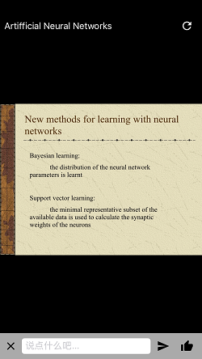
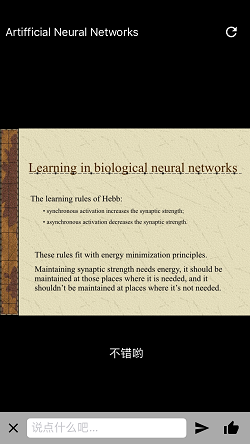

# 弹幕课堂-BiLiClass

> 弹幕式PPT演示系统，随着PPT演示，实时接收的文字信息会以弹幕形式从PPT上飘过。

### 项目背景

是否厌倦了枯燥无味的课堂？是否想改变遥不可及的师生关系？想在课堂上激烈的交流却苦于无法讲话？同桌回答不出问题你却在默默着急？打破传统课堂的沉闷坚冰，贯彻落实课内交流！让老师，学生真正活跃起来，弹幕课堂-BiLiClass 应运而生。

### 功能需求分析

- 课堂系统-PPT 展示：本项目中的课堂系统要能将展示内置的或从网上获取的 PPT 并保持所有设备的同步性展示，使同学们可以在手机屏幕上观看本课程所有的 PPT。
- 弹幕系统：
  - 手机端：手机客户端要包括弹幕发送系统和弹幕接收系统。
    - 打开手机，观看 PPT 的同时，在屏幕下方，可以使用有功能齐全的弹幕发送控件。
    - 在输入框中输入弹幕，输入弹幕时，要上移输入框使其不被键盘遮挡。点
    - 击旁边的发送按钮，或点击键盘上的发送按钮，即可发送弹幕。
    - 如果不想打字，只想表达“很赞”的，同学们可以点赞按钮，即可在屏幕上浮现出爱心。
    - 在一个客户端发送的弹幕和赞要能在所有的客户端中都可以接收并展示。
    - 如果由于不可抗力原因断开连接，要有一个按钮可以重新连接弹幕服务器。
    - 非常高兴的宣布，目前我们已经拥有 iOS 手机客户端。
  - 网页端：在该项目的网页端中，要求同样有弹幕输入框、发送按钮和点赞按钮。
    - 在弹幕输入框中输入内容，点击发送，即可使所有的手机客户端接收到弹幕。
    - 点击点赞按钮，也可以使手机客户端上飘出爱心。
    - 目前只有一个简单的网页版客户端用于测试，网址[戳这里](http://104.194.67.188/barrage/index.html)。

### 项目架构

本项目基于“服务端-客户端”的架构，完成一个简要的弹幕式课堂 PPT 展示系统。

- 服务器负责接收弹幕，分析弹幕的可行性，并发送弹幕给各个连接的客户端。
- 客户端具有发送弹幕、点赞、接受弹幕、展示弹幕的功能。
- 服务器与客户端采用长连接的形式交换数据，客户端可以随时向服务器发送消息，服务器接受到消息也可以及时的发送给客户端。

### 客户端视觉设计

- 基本布局：标题栏在左上角，刷新按钮在右上角，PPT 展示区域在正中间，下方有弹幕发送控件，包括输入框，发送按钮和点赞按钮



- 点击输入框进入输入界面，弹幕发送控件和 PPT 展示区域上浮，使它们不被键盘遮挡。


- 点击“赞”可以发出“like”信息，使屏幕上飘出爱心


- 接收弹幕后可以送屏幕上飘过展示



### 服务端系统实现

采用 Node.js 作为后台的开发语言，采用基于 TCP/IP 作为数据传输协议，利用开源的 Socket.IO 作为数据通信链路层封装工具。基于 Socket.IO 开发具有上述功能的服务器端。

服务器可接收的信息频道为：

- news：客户端向服务器请求连接时发送的消息频道。
- MessageC2S: 客户端向服务器发送的具体消息。

服务器可发送的信息频道为：

- my other event：服务器向客户端表示连接成功
- MessageS2C：服务器向客户端发送的具体消息

数据结构：

```
{
  message: "hello"
}
```

### 手机客户端系统实现

采用 MVC 设计模式，以 iOS 为平台，最终以一个手机 APP 的形式展示弹幕课堂的客户端

Model-SocketManager: 采用单例模式

- initHandler(): 为 SocketManager 注册接收到消息的事件。
- emit(message: String): 发送一条消息。
- delegate: SocketManagerDelegate，将接收到消息展现的到屏幕上的事件交给 ViewController。

View-BarrageView & SendTextView：

- BarrageView:
  - init(): 初始化各个控件的布局，target-action 连接。
  - SocketDidReciveMessage(): 实现 SocketManager 的委托，以label 的形式展示弹幕。
  - reconnectSocket(): 重新连接弹幕服务器。
- SendTextView
  - send(message: String): 发送一条消息。
  - like(): 点赞。

Controller-ViewController：

- 负责将两个 View 加载到主界面上。
- 监听键盘事件，使页面布局不被遮挡。
- 管理内存。

### 网页客户端实现

采用 javaScript 完成该网页

- 引入 Socket.IO。
- 创建按钮并设置点击事件。
- 创建输入框。

### License

MIT

